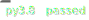
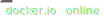
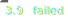
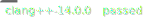
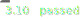
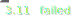

# TSLGen

|Generate|Build|Test|Published|
|:-:|:-:|:-:|:-:|
|[](https://github.com/db-tu-dresden/TVLGen/actions/workflows/tslgen_merge_main.yml)|[](https://github.com/db-tu-dresden/TVLGen/actions/workflows/tslgen_merge_main.yml)|[](https://github.com/db-tu-dresden/TVLGen/actions/workflows/tslgen_merge_main.yml)|[](https://github.com/db-tu-dresden/TVLGen/actions/workflows/tslgen_merge_main.yml)|
|[](https://github.com/db-tu-dresden/TVLGen/actions/workflows/tslgen_merge_main.yml)|[](https://github.com/db-tu-dresden/TVLGen/actions/workflows/tslgen_merge_main.yml)|[](https://github.com/db-tu-dresden/TVLGen/actions/workflows/tslgen_merge_main.yml)||
|[](https://github.com/db-tu-dresden/TVLGen/actions/workflows/tslgen_merge_main.yml)||||
|[](https://github.com/db-tu-dresden/TVLGen/actions/workflows/tslgen_merge_main.yml)|

Template SIMD Library Generator

For writing primitives and extensions check out our [VS-Code extension](https://marketplace.visualstudio.com/items?itemName=DBTUD.tslgen-edit)

Get the latest docker-image with:

```docker pull jpietrzyktud/tvlgen:latest```


